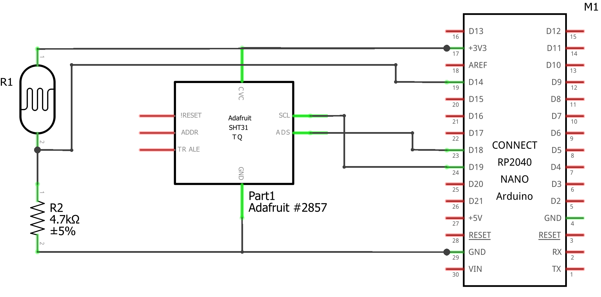
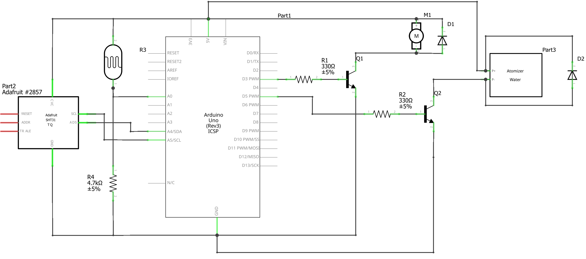
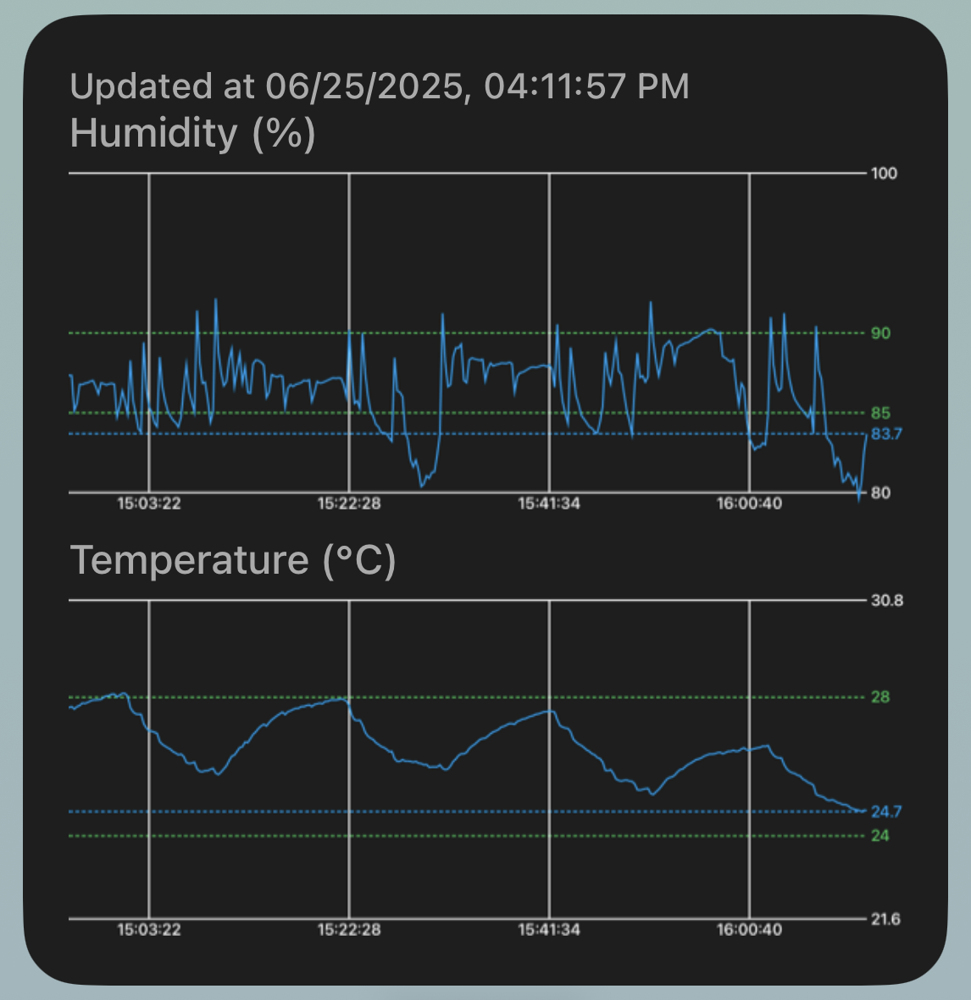

# LazyOrchids
This project uses Arduino to finely control the terrarium environment for growing orchids in an informative way.

# Miniature orchids: challenging to grow, captivating to collect
Miniature orchids are notoriously delicate — they demand precision, consistency, and an almost obsessive level of care. That’s why I created a smart, self-regulating system that removes the stress of cultivation while preserving the beauty of the process. A network of Arduinos manages humidity, temperature, and airflow in real time, maintaining a finely tuned environment that adapts to the needs of each species — varying by time of day and biological preference. Paired with a sleek Scriptable dashboard, growers can monitor their setup remotely with confidence and ease. This isn’t just automation — it’s peace of mind, elegantly delivered, letting collectors trade micromanagement for the quiet joy of watching these captivating miniatures thrive.

## Bulbophyllum lemniscatum
Bulbophyllum lemniscatum is the perfect stress test for any orchid-growing setup. As a miniature epiphyte with extremely narrow tolerance for humidity, temperature, and air circulation, it leaves little room for error — making it an ideal model plant to validate a precision-controlled environment. Its small size demands frequent but gentle moisture, and its sensitivity to nighttime humidity shifts pushes the responsiveness of any automated system to the limit. By choosing B. lemniscatum as my benchmark species, I ensured that the Arduino-based setup and Scriptable monitoring interface are not just functional, but capable of meeting the high standards required by one of the most finicky orchids in cultivation. If this system can keep B. lemniscatum thriving, it can handle just about anything.

# Workflow
## Supervisor 
Arduino Nano 33 IoT is used as the supervisor to measure and upload the readings of the terrarium to ThingSpeak so iPhone can see it through Scriptable widget
* In addition to Arduino Nano 33 IoT, a commercial hygrometer-thermometer 
  is put in the terrarium as a 3rd party supervisor. It also acts as a quick 
  raw-eye check 
## Worker
Arduino Uno R3 is used as the worker to read terrarium environment factors 
(temperature, humidity, light)
and make actions directly (activates either fan or mister)

# Setup 
## General terrarium
### Requirements 
* 1 × big plastic bottle
* Some water gel beads 
* Some Sphagnum moss 
* 1 × small glass as water tank for mister
* 3D designed holders 
  * Fan motor holder
  * Mister disc holder

## Supervisor
### Requirements
* Hardware 
  * 1 × Arduino Nano 33 IoT
  * 1 × SHT31 temperature humidity sensor
  * 1 × Light dependent resistor (LDR) / photoresistor (photocell)
  * 1 × 4.7 kΩ resistor 
* Software 
  * Arduino IDE
  * ThingSpeak 
  * Scriptable 
* Access to Wi-Fi

### Wiring 

  

## Worker
### Requirements
* Hardware 
  * 1 × Arduino Uno R3 
  * 1 × SHT31 temperature humidity sensor
  * 1 × LDR
  * 1 × 4.7 kΩ resistor
  * 1 × Fan blade + 3-6 V motor
  * 1 × water atomizer / mister + control board
  * 2 × Diode rectifier
  * 2 × NPN transistor PN2222 
  * 2 × 330 Ω resistor
* Software 
  * Arduino IDE

### Wiring

  

Notice:
* Fan motor is connected to D3. This is very important so you can reduce the frequency for the Timer2 (See `Worker/fan.ino's setup_fan()`) to reduce the motor noise when running the fan 
  * Another very useful tip is to ensure that the motor is securely mounted to the holder to avoid vibration. This can also largely reduce the noise

## Scriptable widget
Using code `ThingSpeak_widget/auto_thingspeak_plot.js` in Scriptable allows you to obtain and plot the data from ThingSpeak (uploaded by the Supervisor Arduino) dynamically and display the data on your iphone
* The plotting limits and ideal ranges will change automatically using the latest LDR readings to determine whether it's day or night

  

# Notes 
Arduino IDE
* Changes made in Arduino IDE won't be automatically picked up in CLion 

ThingSpeak 
* For free tier users, you're allowed to upload data once per 15 seconds
* For the supervisor, you can technically split the data upload for sensor 
  and LDR, and set it like upload the sensor data every 15 seconds and LDR 
  data every 30 seconds. However, ThingSpeak will regard that per 15 second,
  you have 2 batches of data to upload and that exceeds the one upload per 
  15 seconds, resulting in the latter data upload always failed. This can 
  be seen in the branch `supervisor_individual_timer`. Because of that, 
  I'll always upload the data all at once

